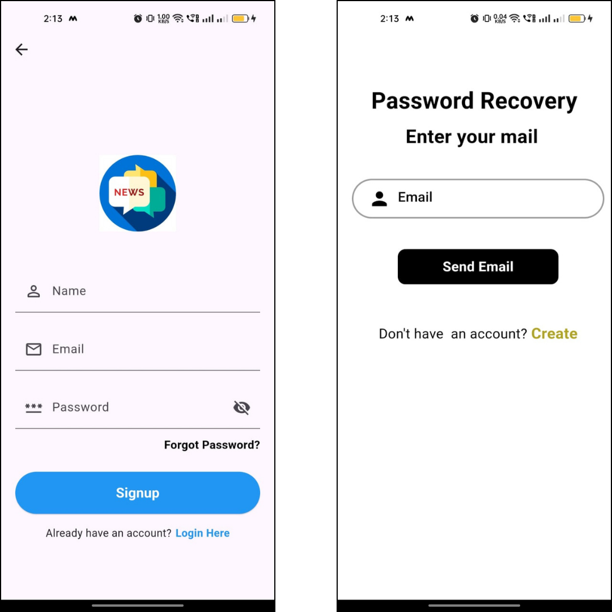
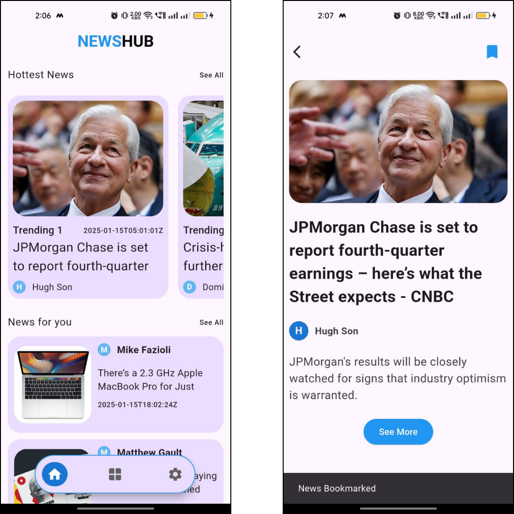
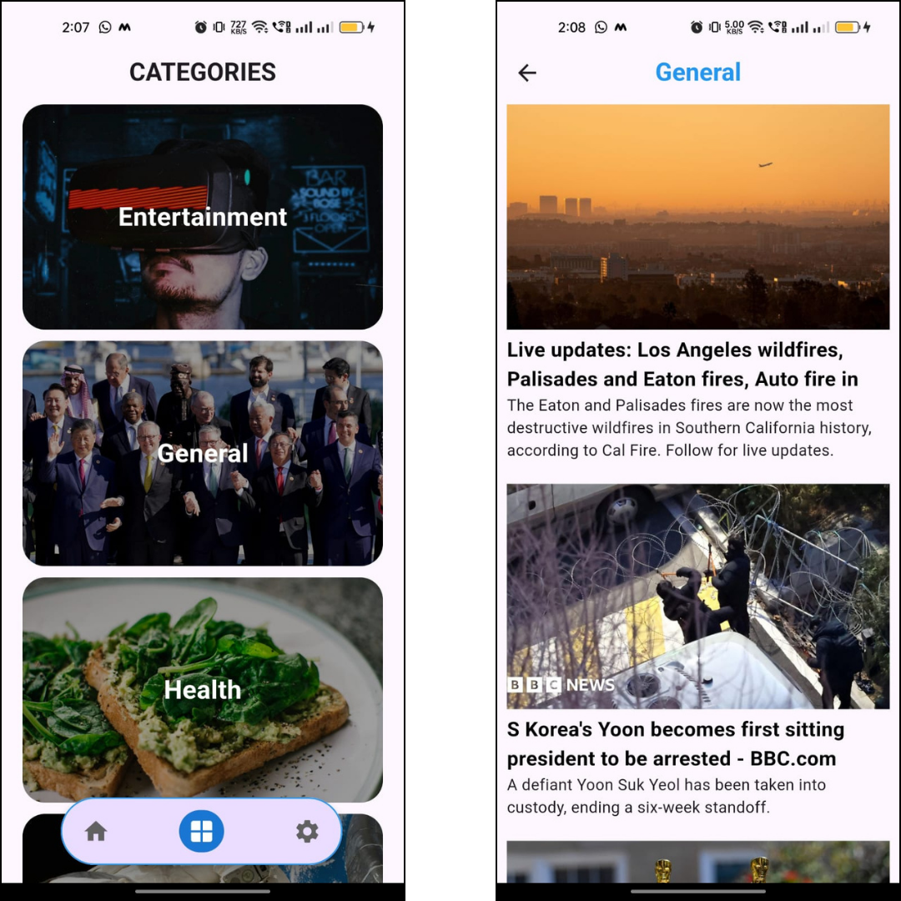
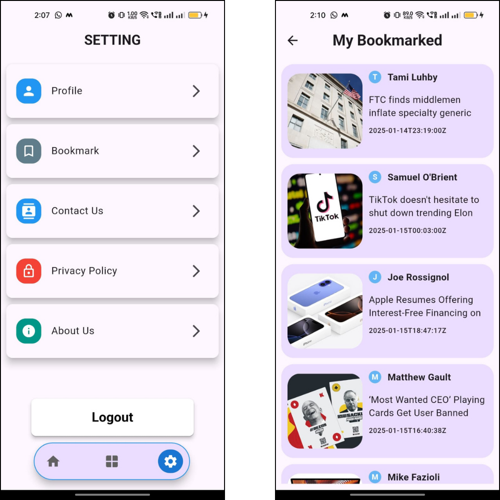

# NewsHub App

  
*A lightweight Flutter-based news app delivering real-time updates.*

## 🌍 Introduction
NewsHub is a cutting-edge mobile application designed to simplify news consumption by providing real-time headlines and categorized news from reliable sources. With an intuitive interface, integrated WebView, and user authentication, NewsHub ensures a seamless and personalized reading experience without the need for external browsers or apps.

## 📌 Features
- 🔥 **Real-time News Updates** - Fetches live headlines every 24 hours.
- 📂 **Categorized News** - Browse Politics, Entertainment, Sports, and Technology.
- 📖 **Integrated WebView** - Read full articles within the app.
- 🔒 **User Authentication** - Save preferences for a personalized experience.
- 🎨 **Intuitive UI** - Seamless navigation and user-friendly interface.
  
## 🛠️ Tech Stack
- **Flutter** - UI Framework
- **Firebase** - Authentication & Storage
- **NewsAPI** - News Fetching
- **Dart** - Programming Language

  
## 🚀 Installation

1. **Clone the Repository**
   ```sh
   git clone https://github.com/yourusername/newshub.git
   cd newshub
   ```
2. **Install Dependencies**
   ```sh
   flutter pub get
   ```
3. **Run the App**
   ```sh
   flutter run
   ```
## 🔥 Firebase Setup
1. Create a Firebase project at [Firebase Console](https://console.firebase.google.com/).
2. Register your app and download the `google-services.json` file.
3. Place `google-services.json` inside `android/app/` directory.
4. Enable Firebase Authentication and Firestore from the Firebase console.
5. Run the following command to ensure Firebase is properly configured:
   ```sh
   flutterfire configure
   ```

## 📷 Screenshots
### Login Screen


### Home Screen

### Categories Screen


### Setting Screen



